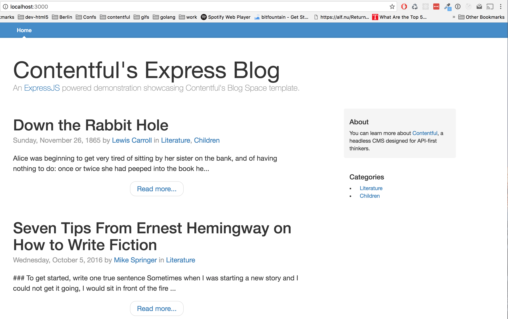

This example showcases usage of the Contentful Delivery API through the Node.js SDK for building the blog using the Blog demo space.



# About

[Contentful](https://www.contentful.com) is a content management platform for web applications, mobile apps and connected devices. It allows you to create, edit & manage content in the cloud and publish it anywhere via a powerful API. Contentful offers tools for managing editorial teams and enabling cooperation between organizations.

# Installation & usage

Clone the project 

```sh
$ git clone https://github.com/contentful/cf-expressjs-blog
```

Install dependencies

```sh
$ npm install
```

To check the app in the browser navigate to `http://localhost:3000`

Start the project

```sh
npm start
```
# Documentation

## Service modules
* The [cf](services/cf.js) module is encapsulating Contentful's specifics like the API key, as well as constants for content type identifiers
* The [blog](services/blog.js) module is a service taking care of calling Contentful and normalizing the results from the API

## View
* The main CSS structure comes from the [Bootstrap blog template](http://getbootstrap.com/examples/blog/) it is defined in the [layout](views/layout.jade) template.

* Blog posts rendering is handled in the [mixins](views/mixins.jade), so it can be reused in the [category](views/category.jade) and [index](views/index.jade) views.
